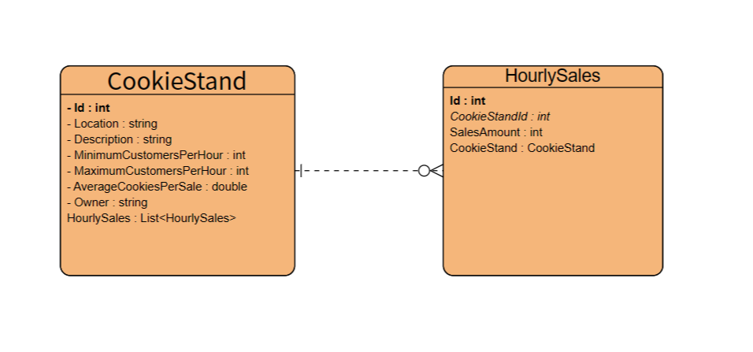

# cookie-stand-api
The **Cookie Stand API** is a web application for managing cookie stands. It allows you to create, retrieve, update, and delete information about cookie stands and their hourly sales.

## Usage
### API Endpoints
### HourlySales Endpoints
- Create HourlySales
    - HTTP Method: POST
    - Endpoint: /api/hourlysales
    - Description: Create a new hourly sale entry for a specific cookie stand.
    - Request Body (JSON):

           {
             "cookieStandId": 1,
          "salesAmount": 15.5,
          "hour": 14
            }
- Get All HourlySales

   - HTTP Method: GET
   - Endpoint: /api/hourlysales
   - Description: Get a list of all hourly sales entries for all cookie stands.
- Get HourlySales by ID
    - HTTP Method: GET
    - Endpoint: /api/hourlysales/{id}
    - Description: Get details of a specific hourly sale entry by its ID.
- Update HourlySales
    - HTTP Method: PUT
    - Endpoint: /api/hourlysales/{id}
    - Description: Update the details of a specific hourly sale entry by its ID.
    - Request Body (JSON):

                 {
           "salesAmount": 20.0
            }
- Delete HourlySales
    - HTTP Method: DELETE
    - Endpoint: /api/hourlysales/{id}
    - Description: Delete a specific hourly sale entry by its ID.
    - 
These endpoints allow you to manage and track the hourly sales for your cookie stands. Please replace {id} with the actual ID of the hourly sale entry you want to interact with when making requests to these endpoints.

### CookieStand Endpoints
- Create CookieStand

HTTP Method: POST

Endpoint: /api/cookiestand

Description: Create a new cookie stand.

Request Body (JSON):

                {
           "location": "Barcelona",
           "description": "",
           "minimum_customers_per_hour": 3,
           "maximum_customers_per_hour": 7,
           "average_cookies_per_sale": 2.5,
           "owner": null
        }
- Get All CookieStands

HTTP Method: GET

Endpoint: /api/cookiestands

Description: Get a list of all cookie stands.

- Get CookieStand by ID

HTTP Method: GET

Endpoint: /api/cookiestand/{id}

Description: Get details of a specific cookie stand by its ID.

- Update CookieStand

HTTP Method: PUT

Endpoint: /api/cookiestand/{id}

Description: Update the details of a specific cookie stand by its ID.

- Delete CookieStand

HTTP Method: DELETE

Endpoint: /api/cookiestand/{id}

Description: Delete a specific cookie stand by its ID.

These endpoints allow you to manage and interact with the cookie stands in your Cookie Stand API. Please replace {id} with the actual ID of the cookie stand you want to interact with when making requests to these endpoints.-
### Swagger Documentation
You can explore and test the API using Swagger UI. Visit  your localhost path in your web browser after starting the application.
## Database Structure (ERD)
- ERD

The Entity Relationship Diagram (ERD) represents the database structure for cookie stands and hourly sales.
